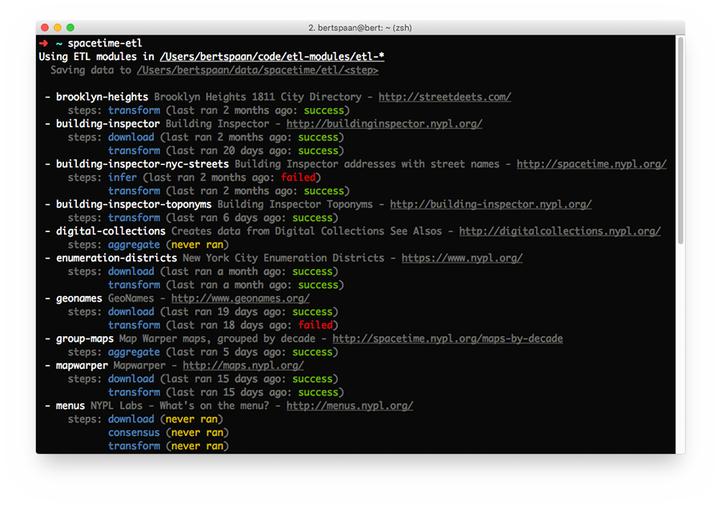

# NYC Space/Time Directory ETL tool

[Extract/Transform/Load](https://en.wikipedia.org/wiki/Extract,_transform,_load) tool for [NYC Space/Time Directory](http://spacetime.nypl.org) data: it loads separate data modules which perform ETL tasks, such as downloading and transforming data to the [NYC Space/Time Directory data model](https://github.com/nypl-spacetime/ontology).

For more information about the NYC Space/Time Directory project, as well as datasets produced by spacetime-etl, see http://spacetime.nypl.org.



## ETL Modules

Space/Time's ETL modules are separate Node.js modules which need to be installed individually. Each ETL module represents a NYC Space/Time Directory dataset or data transformation, and defines a set of _steps_; spacetime-etl loads these modules, and executes the steps they define.

Some examples:

| ETL Module                                                                     | Description
|--------------------------------------------------------------------------------|-----------------------------------------
| [`etl-mapwarper`](https://github.com/nypl-spacetime/etl-mapwarper)                          | Outlines of maps from [Map Warper](http://maps.nypl.org/warper/), NYPL's tool for georectifying historical maps
| [`etl-group-maps`](https://github.com/nypl-spacetime/etl-group-maps)           | Map Warper maps, grouped by decade — used by [Maps by Decade](http://spacetime.nypl.org/maps-by-decade/#/)
| [`etl-spacetime-graph`](https://github.com/nypl-spacetime/etl-spacetime-graph) | Graph of all NYC Space/Time Directory datasets
| [`etl-oldnyc`](https://github.com/nypl-spacetime/etl-oldnyc)                   | Locations of 40,000 geotagged photos from [OldNYC](https://www.oldnyc.org/)

For more ETL modules, [see GitHub](https://github.com/nypl-spacetime?utf8=%E2%9C%93&q=etl-).

## Configuration

The configuration of the data tool is done in the [NYC Space/Time Directory configuration file](https://github.com/nypl-spacetime/spacetime-config), under the `etl` key.

The following configuration options must be specified:

| Parameter      | Description
|----------------|-----------------------------------------------------------------------------------------
| `moduleDir`    | Path (absolute, or relative to data tool) where spacetime-etl looks for data modules
| `modulePrefix` | Directory prefix used to identify data modules (e.g. `etl-mapwarper`) — default is `etl-`
| `outputDir`    | Directory to which ETL modules write their data

Example:

```yml
etl:
  modulePrefix: "etl-"
  moduleDir: /Users/bertspaan/code/etl-modules
  outputDir: /Users/bertspaan/data/spacetime/etl
```

The configuration of the separate ETL modules can also be done in configuration file. Please see the README of the respective ETL modules for more information. Example:

```yml
etl:
  modules:
    geonames:
      types:
        PPL: 'st:Place'
        PPLX: 'st:Neighborhood'
```

## Usage & Installation

### Installing ETL Modules

To use spacetime-etl to run ETL modules, you first need to install them. Go to the directory specified by the `baseDir` configuration option, and clone the ETL modules you need, for example:

    git clone https://github.com/nypl-spacetime/etl-nyc-wards.git
    git clone https://github.com/nypl-spacetime/etl-mapwarper.git
    git clone https://github.com/nypl-spacetime/etl-oldnyc.git

Then, install the dependencies of each module:

    cd etl-nyc-wards
    npm install
    cd ..
    cd etl-mapwarper
    npm install
    cd ..
    cd etl-oldnyc
    npm install

You can now use spacetime-etl to run the three ETL modules you have just installed: `nyc-wards`, `mapwarper` and `oldnyc`.

### Command-line Interface

Installation:

    npm install -g nypl-spacetime/spacetime-etl

Run the data tool without command-line arguments to get a list of the available data modules:

    spacetime-etl

To run one or more ETL modules, provide their IDs as command-line arguments:

    spacetime-etl mapwarper oldnyc ...

Alternatively, you can select the processing steps you want to run:

    spacetime-etl mapwarper.download

By default, all steps are run consecutively.

### From a Node.js script

Installation:

```
npm install nypl-spacetime/spacetime-etl
```

Usage (to run this example, first install [`etl-mapwarper`](https://github.com/nypl-spacetime/etl-mapwarper), see [Installing ETL Modules](#installing-etl-modules)):

```js
const etl = require('spacetime-etl')

etl('mapwarper', (err) => {
  if (err) {
    console.error('Error:')
    console.error(err)
  } else {
    console.log('Done!')
  }
})
```

The produced data files are written in a subdirectory of the configured output directory: `<outputDir>/<step>/mapwarper`.

## Creating an ETL module from scratch

It's easy! Let's say we want to write a scraper which, very illegally, reads photos and their metadata from the [NYC Municipal Archives Online Gallery](http://nycma.lunaimaging.com/luna/servlet/detail/RECORDSPHOTOUNITARC~21~21~617236~111844:dma_16095).

First, create a directory in spacetime-etl's `baseDir` with the following name:

    mkdir etl-nyc-municipal-archives

In this directory, create two files:

First, `nyc-municipal-archives.dataset.json`, holding the metadata of the ETL module and the resulting dataset:

```js
{
  "id": "nyc-municipal-archives",
  "title": "NYC Municipal Archives Online Gallery",
  "license": "CC0",
  "description": "The NYC Municipal Archives Online Gallery provides research access to over 900,000 items digitized from the Municipal Archives' vast holdings, including photographs, maps, motion-pictures and audio recordings",
  "author": "Bert Spaan",
  "website": "http://nycma.lunaimaging.com/luna/servlet"
}
```

The actual code goes in `nyc-municipal-archives.js`:

```js
function download (config, dirs, tools, callback) {
  // Download data, write data to output directory;
  //   dirs.current contains the path of the
  //   output directory of the current step

  // config object contains configuration from
  // this module's section (if available)

  callback()
}

function transform (config, dirs, tools, callback) {
  // Read downloaded data from output directory;
  //   dirs.download contains the path of the
  //   output directory of the download step

  // Do data transformations, and write the
  //   resulting Space/Time objects to disk
  //   using tools.writer

  const object = {
    type: 'object',
    obj: {
      id: 1,
      type: 'st:Photo'
      data: {
        title: '',
        collection: ''
      },
      geometry: {
        type: "Point",
        coordinates: [
          -74.014592,
          40.702211
        ]
      }
    }
  }

  tools.writer.writeObject(object, callback)
}

module.exports.steps = [
  download,
  transform
]
```

You can now run this ETL module with the following command:

    spacetime-etl nyc-municipal-archives

Copyright (C) 2015 [Waag Society](http://waag.org), 2017 [The New York Public Library](http://nypl.org)
